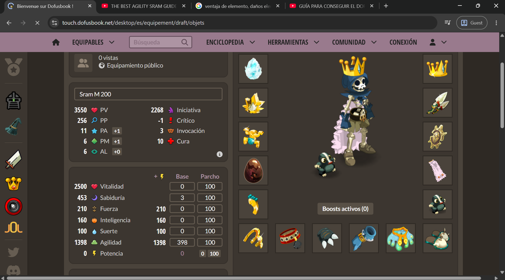

# 📊 Prueba de Actualización y Gráficos

Esta página fue añadida para verificar la sincronización automática de contenido multimedia en **Read the Docs**.

# Visualización de Componentes
A continuación se muestra el esquema cargado desde el repositorio:

* **Estado:** Sincronizado correctamente.
* **Actualización:** Automática vía GitHub Webhook.
